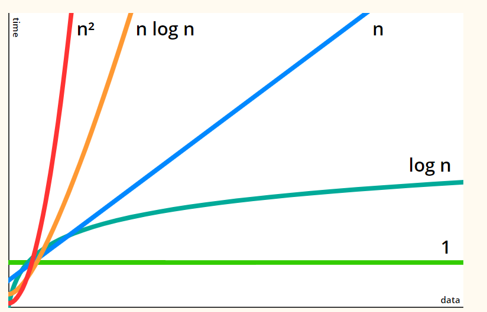

## big O là gì ?


Thuật toán là một một chuôi các thủ tục nhằm thưc hiện một nhiệm vụ nào đó với số bước thực hiện là hữu hạn.Có thể coi từng dòng code của bạn là thuật toán . Đế đánh giá thuật toán người ta dùng kí hiệu chữ "O lớn".Tạm thời để nó qua 1 bên ta xét trường hợp sau .VTV3 trong khoảng thời gian này phát sóng chương trình "chọn đâu cho đúng " .Đến vòn cuối cùng MC đọc câu hỏi có đáp án là số ,và người chơi đưa ra câu trả lời.Nếu câu trả lời cao hơn so với đáp án MC nhắc nhở "xuống" ,còn thấp hơn thì nhắc nhở "lên".Yêu cầu trong 90 giây trả lời được 5 câu hỏi là giành được giải thường cao nhất của chương trình.

Như vậy cần đưa ra được đáp án đúng với số bước đoán cang it càng tốt .Cách mà nhiều người chơi là đọc lần lượi cho đến khi đạt được kêt quả đúng . Đây là cách mà chắc chắn không lập trình viên nào lựa chọn.
    VD Câu hỏi "mĩ ném bom xuống Hiroshima năm bao nhiêu ".thay vì liệt kê lần lượi từ 1900 đên 2000 hãy bắt đầu với 1950 rồi nhận được nhắc nhở là nhỏ hơn bạn tiếp tục đoán 1925 -> Lớn hơn->1933 ->lớn hơn _>1945 >chính xác . rõ ràng cách này giảm được rất nhiều bước. 

Mỗi khi nhắc đến thuật toán cái mà người ta nhắc kem theo luôn là thời gian chạy(running time).như ví dụ trên:nếu mỗi lần đoán mất 1 giây ,theo cách bình thường ta mất 45 giây,còn tìm theo số ở giữa ta mất 4s .Thời gian thực hiện một giải thuật bằng chương trình máy tính phụ thuộc vào các yếu tố :

+ kích thước dữ liệu đầu vào .Giải thuật với dữ liệu đầu vào càng lớn thì  thì thời gian chạy càng dài 
+ Tổ chức phần cứng : hệ thống có tố độ sử lý nhanh hơn đương nhiên  sẽ cho kết quả chạy giải thuật nhanh hơn .Tuy nhiên trong phạm vi giải thuật người ta không xét yếu tố này , coi các giải thuật chạy trên hệ thống có tốc độ sử lý tương đương 

Kí hiệu "**chữ O lớn**"  là kí tự đặc biệt cho bạn biết mức độ nhanh của thuật toán hay nôm na ký hiệu độ phức tạp thuật toán . Các kí hiệu thường gặp:O(n),O(logn),O(nLogn),O(n*n),O(n!),...Trong Kí hiệu O Log n Là logarit cơ số 2 của n .

Nếu hiếu theo cách đơn giản mỗi vòng for bạn lặp từ 0 đến n thì cho ta thời gian chạy là n.Lồng trong đó 1 vòng for tương tự ta có thời gian chạy là n*n,độ tăng chường 1 số thuật toán cho bởi hình sau   :



Thời gian chạy một số thuật toán cơ bản :

| độ phức tạp | Tên gọi             | Ví dụ                                                     |
| ----------- | ------------------- | --------------------------------------------------------- |
| O(1)        | constant (hằng số ) | gán hay tìm kiếm theo chỉ số                              |
| O(logn)     | Logarithm           | Tìm kiếm nhị phân                                         |
| O(n)        | Linear(tuyến tính)  | Duyệt danh sách                                           |
| O(nlogn)    | loglinear           | Các thuật toán sắp xếp cải tiến như merge sort,quick sort |
| O(n^2)      | Quaratic            | Các thuật toán so sánh đối tượng                          |
| O(n^3)      | Cubic(Bậc 3`)       | Thuật toán floyd                                          |
| O(n^m)      | Polynomial          | Lông                                                      |
| O           | Factorial           | Thuật toán cực kì chậm(Bài toán người du lịch)            |


### Độ phức tạp của một số cấu trúc lệnh 

1. O(c)

   ```c
   for(i=1;i<=c;i++){
       //tập lệnh có độ phưc tạp O(1)
   }//for 
   ```

2. O(n)  

   ``` c
   for(i=1;i<=n;i++){
       //tập lệnh có độ phưc tạp O(1)
   }//for
   ```

3. O(n^2) 

   ``` c
   for(i=1;i<=n;i++){
       for(j=1;j<=n;j++)
       //tập lệnh có độ phưc tạp O(1)
   }//for
   ```

4. O(Logn)

   ``` c
   for(i=1;i<=n;i*c){
       //tập lệnh có độ phưc tạp O(1)
   }//for
   ```

   