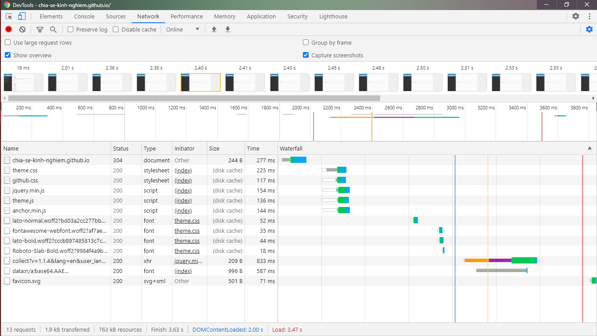

# Devtool chrome Network

### 1 ,Waterfall

Là dòng thời gian chạy cho đến khi yêu cầu được hoàn toàn được sử lý ,mỗi màu trên waterfall tượng trưng cho một công đoạn mà trình duyệt sử lý .Khoảng màu dài cho thấy thời gian công đoạn được hoàn thành càng lâu . Từ đó ta đánh giá được  hiệu năng hệ thống :

2,Ý nghĩa các màu trong Waterfall

+ Queueing :Hàng đợi lưu các request ,các request được thực hiện lần lượt,nếu time requering lớn có nghĩa hàng đợi phải xử lý nhiều request 

  + Request bị lưu lại bởi "redering engine" do nhều request có độ ưu tiên thấp( như image) hơn các request tài liệu(như scripts/style)

  + Các request được lưu cho đến kho cổng tcp trống .do trình duyệt chỉ cho phép 6 kết nối tcp cùng 1 lúc trên http 1

  + thời gian ở đây là giành cho ghi cache 

    

+ Stalled :thời gian request phải đợi trược khi nó được gửi . Nó phải đợi phải queue như đã nói ở trên.Thêm vào đó là thời gian giành để thiết lập với proxy(Proxy Negotiation)

+ DNS Lookup : Thời gian phân giải tên miền ra địa chỉ .Mỗi tên miền đều cần phân giải .Quá trình này thường nhanh do địa chỉ ip thường được lưu trong cache 

+ Initial connection():thời gian khở tạo kết nối bao gồm tcp "handshakes/retries" và thiết lập SSL.

+ ssl:Kết nối với ssl

+ request sent :thời gian thực gửi request  thường la mili giây

+ waiting (TTFB):thời gian đợi thiêt lập phản hồi hay "time to first bytes",nó ghi lại hành trình tới server và thời gian server phản hồi 

+ Content dowload : thời gian nhận dữ liệu phản hồi 

### Capture screenshots 

Bạn muốn xem lại cách trang web được duyệt trong từng khoảng thời gian nhất định devtool có hỗ trợ chụp màn hình .Tích vào ô capture screenshots hoặc kích vào biểu tượng máy quay để chụp lại .Lưu ý qua trình ghi hình mất kha khá thời gia nhé:

  

  

  

  

  

  

  

  

  